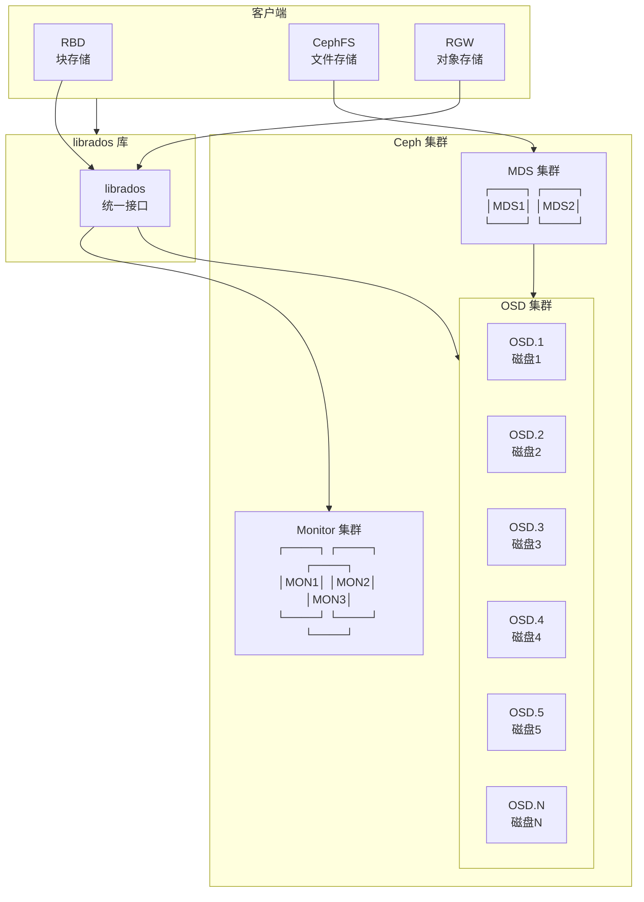
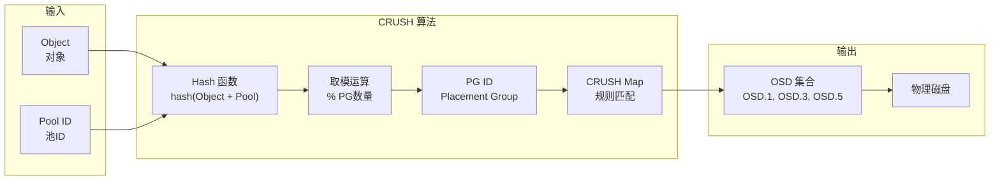
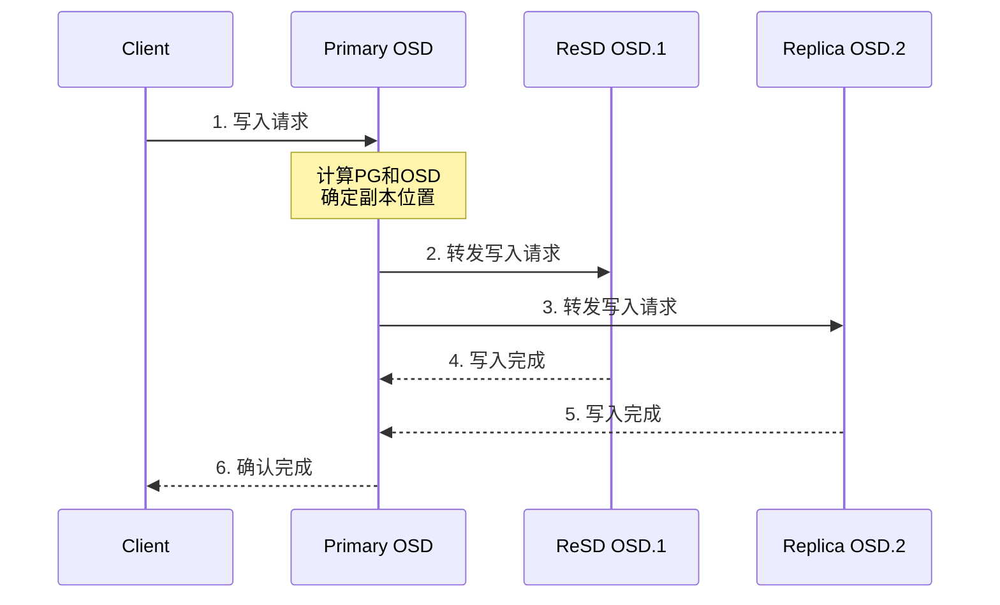
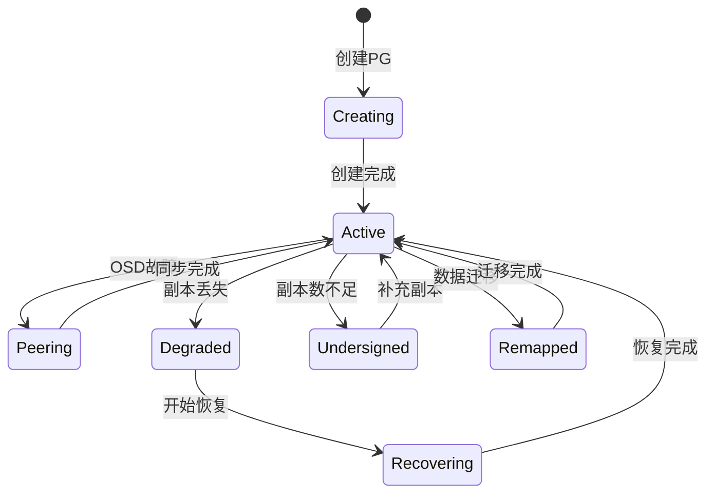
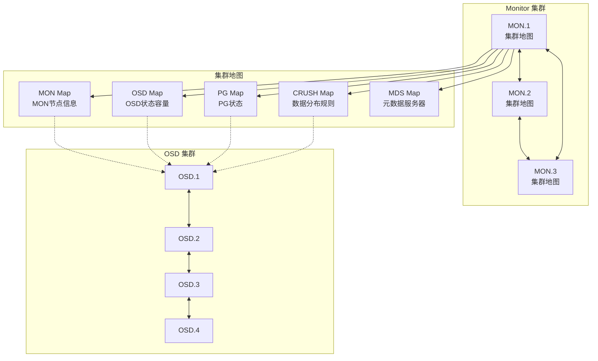
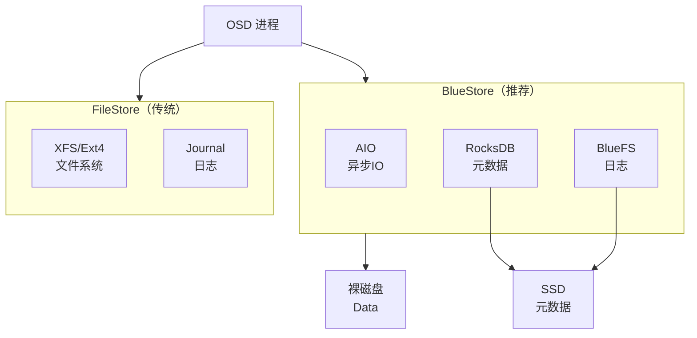
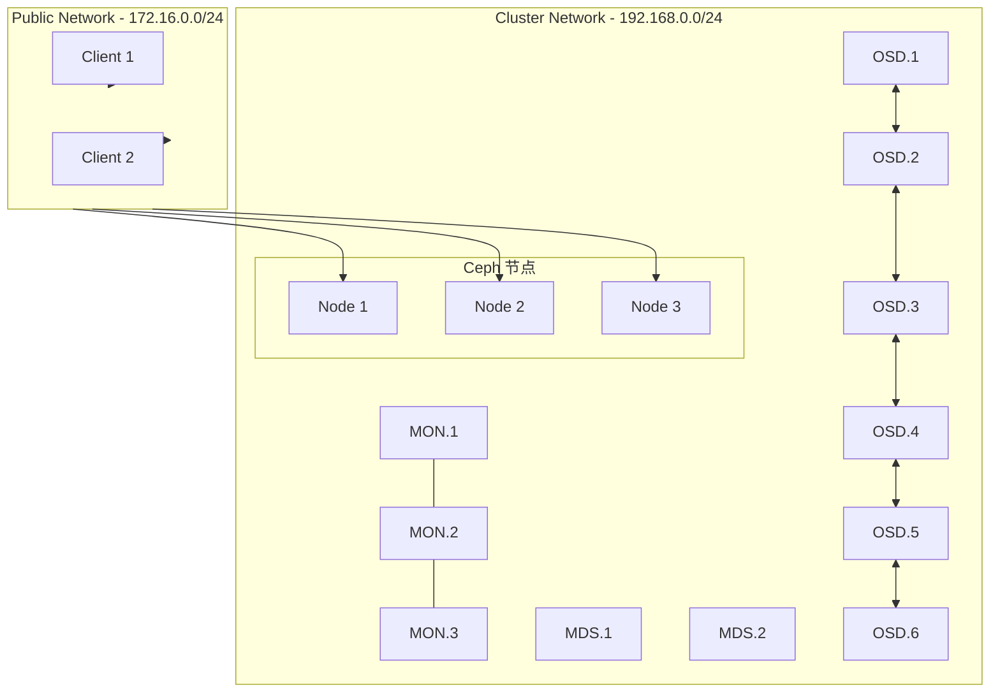
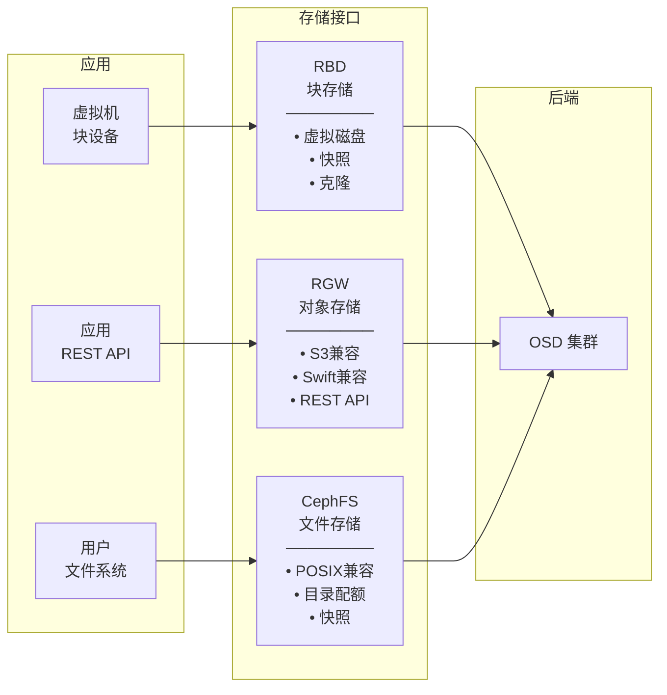
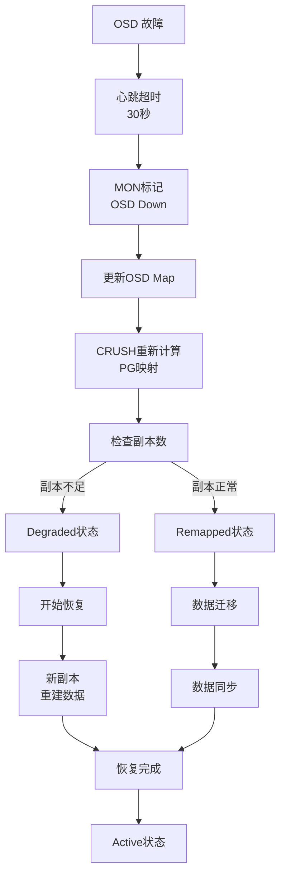

# Ceph 详细架构图

## 整体架构

```mermaid
flowchart TB
    subgraph Client["客户端"]
        direction TB
        RBD["RBD<br/>块存储"]
        CEPHFS["CephFS<br/>文件存储"]
        RGW["RGW<br/>对象存储"]
    end
    
    subgraph Librados["librados 库"]
        LIB["librados<br/>统一接口"]
    end
    
    subgraph Cluster["Ceph 集群"]
        direction TB
        MON["Monitor 集群<br/>┌────┐ ┌────┐ ┌────┐<br/>│MON1│ │MON2│ │MON3│<br/>└────┘ └────┘ └────┘"]
        MDS["MDS 集群<br/>┌────┐ ┌────┐<br/>│MDS1│ │MDS2│<br/>└────┘ └────┘"]
        
        subgraph OSDs["OSD 集群"]
            OSD1["OSD.1<br/>磁盘1"]
            OSD2["OSD.2<br/>磁盘2"]
            OSD3["OSD.3<br/>磁盘3"]
            OSD4["OSD.4<br/>磁盘4"]
            OSD5["OSD.5<br/>磁盘5"]
            OSDN["OSD.N<br/>磁盘N"]
        end
    end
    
    Client --> Librados
    RBD --> LIB
    CEPHFS --> MDS
    RGW --> LIB
    LIB --> MON
    LIB --> OSDs
    MDS --> OSDs
```

## 数据寻址流程

```mermaid
flowchart LR
    subgraph Input["输入"]
        OBJ["Object<br/>对象"]
        POOL["Pool ID<br/>池ID"]
    end
    
    subgraph Process["CRUSH 算法"]
        HASH["Hash 函数<br/>hash(Object + Pool)"]
        MOD["取模运算<br/>% PG数量"]
        PG["PG ID<br/> Placement Group"]
        CRUSH["CRUSH Map<br/>规则匹配"]
    end
    
    subgraph Output["输出"]
        OSDS["OSD 集合<br/>OSD.1, OSD.3, OSD.5"]
        DISK["物理磁盘"]
    end
    
    OBJ --> HASH
    POOL --> HASH
    HASH --> MOD
    MOD --> PG
    PG --> CRUSH
    CRUSH --> OSDS
    OSDS --> DISK
```

## 写入流程

```mermaid
sequenceDiagram
    participant Client as Client
    participant Primary as Primary OSD
    participant Replica1 as ReSD OSD.1
    participant Replica2 as Replica OSD.2
    
    Client->>Primary: 1. 写入请求
    Note over Primary: 计算PG和OSD<br/>确定副本位置
    Primary->>Replica1: 2. 转发写入请求
    Primary->>Replica2: 3. 转发写入请求
    Replica1-->>Primary: 4. 写入完成
    Replica2-->>Primary: 5. 写入完成
    Primary-->>Client: 6. 确认完成
```

## PG 状态机

```mermaid
stateDiagram-v2
    [*] --> Creating: 创建PG
    Creating --> Active: 创建完成
    Active --> Peering: OSD故障
    Peering --> Active: 同步完成
    Active --> Degraded: 副本丢失
    Degraded --> Recovering: 开始恢复
    Recovering --> Active: 恢复完成
    Active --> Undersigned: 副本数不足
    Undersigned --> Active: 补充副本
    Active --> Remapped: 数据迁移
    Remapped --> Active: 迁移完成
```

## 集群组件关系

```mermaid
flowchart TB
    subgraph MON["Monitor 集群"]
        MON1["MON.1<br/>集群地图"]
        MON2["MON.2<br/>集群地图"]
        MON3["MON.3<br/>集群地图"]
    end
    
    subgraph ClusterMap["集群地图"]
        MONMAP["MON Map<br/>MON节点信息"]
        OSMAP["OSD Map<br/>OSD状态容量"]
        PGMAP["PG Map<br/>PG状态"]
        CRUSH["CRUSH Map<br/>数据分布规则"]
        MDSMAP["MDS Map<br/>元数据服务器"]
    end
    
    subgraph OSDCluster["OSD 集群"]
        OSD1["OSD.1"]
        OSD2["OSD.2"]
        OSD3["OSD.3"]
        OSD4["OSD.4"]
    end
    
    MON1 <--> MON2
    MON2 <--> MON3
    MON3 <--> MON1
    
    MON1 --> MONMAP
    MON1 --> OSMAP
    MON1 --> PGMAP
    MON1 --> CRUSH
    MON1 --> MDSMAP
    
    OSD1 <--> OSD2
    OSD2 <--> OSD3
    OSD3 <--> OSD4
    
    MONMAP -.-> OSD1
    OSMAP -.-> OSD1
    PGMAP -.-> OSD1
    CRUSH -.-> OSD1
```

## 存储引擎

```mermaid
flowchart TB
    subgraph BlueStore["BlueStore（推荐）"]
        direction TB
        AIO["AIO<br/>异步IO"]
        RocksDB["RocksDB<br/>元数据"]
        CACHE["BlueFS<br/>日志"]
    end
    
    subgraph FileStore["FileStore（传统）"]
        direction TB
        XFS["XFS/Ext4<br/>文件系统"]
        Journals["Journal<br/>日志"]
    end
    
    OSDProcess["OSD 进程"] --> BlueStore
    OSDProcess --> FileStore
    
    BlueStore --> Disk1["裸磁盘<br/>Data"]
    RocksDB --> SSD["SSD<br/>元数据"]
    CACHE --> SSD
```

## 高可用架构

```mermaid
flowchart TB
    subgraph PublicNetwork["Public Network - 172.16.0.0/24"]
        Client1["Client 1"]
        Client2["Client 2"]
    end
    
    subgraph ClusterNetwork["Cluster Network - 192.168.0.0/24"]
        subgraph CephNodes["Ceph 节点"]
            direction TB
            Node1["Node 1"]
            Node2["Node 2"]
            Node3["Node 3"]
        end
        
        MON1["MON.1"] 
        MON2["MON.2"]
        MON3["MON.3"]
        MDS1["MDS.1"]
        MDS2["MDS.2"]
        OSD1["OSD.1"]
        OSD2["OSD.2"]
        OSD3["OSD.3"]
        OSD4["OSD.4"]
        OSD5["OSD.5"]
        OSD6["OSD.6"]
    end
    
    Client1 --> PublicNetwork
    Client2 --> PublicNetwork
    
    PublicNetwork --> Node1
    PublicNetwork --> Node2
    PublicNetwork --> Node3
    
    Node1 --- ClusterNetwork
    Node2 --- ClusterNetwork
    Node3 --- ClusterNetwork
    
    MON1 --- MON2
    MON2 --- MON3
    
    OSD1 <--> OSD2
    OSD2 <--> OSD3
    OSD3 <--> OSD4
    OSD4 <--> OSD5
    OSD5 <--> OSD6
```

## 三种存储接口

```mermaid
flowchart LR
    subgraph Applications["应用"]
        VM["虚拟机<br/>块设备"]
        APP["应用<br/>REST API"]
        USER["用户<br/>文件系统"]
    end
    
    subgraph Interfaces["存储接口"]
        RBD["RBD<br/>块存储<br/>────────<br/>• 虚拟磁盘<br/>• 快照<br/>• 克隆"]
        RGW["RGW<br/>对象存储<br/>────────<br/>• S3兼容<br/>• Swift兼容<br/>• REST API"]
        CEPHFS["CephFS<br/>文件存储<br/>────────<br/>• POSIX兼容<br/>• 目录配额<br/>• 快照"]
    end
    
    subgraph Backend["后端"]
        OSDs["OSD 集群"]
    end
    
    VM --> RBD
    APP --> RGW
    USER --> CEPHFS
    
    RBD --> OSDs
    RGW --> OSDs
    CEPHFS --> OSDs
```

## 故障恢复流程

```mermaid
flowchart TB
    Start["OSD 故障"] --> Timeout["心跳超时<br/>30秒"]
    Timeout --> MarkDown["MON标记<br/>OSD Down"]
    MarkDown --> UpdateMap["更新OSD Map"]
    UpdateMap --> Recalc["CRUSH重新计算<br/>PG映射"]
    Recalc --> CheckReplica["检查副本数"]
    
    CheckReplica --> |副本不足| Degraded[Degraded状态]
    CheckReplica --> |副本正常| Remapped[Remapped状态]
    
    Degraded --> StartRecover["开始恢复"]
    Remapped --> Migrate["数据迁移"]
    
    StartRecover --> NewReplica["新副本<br/>重建数据"]
    Migrate --> DataSync["数据同步"]
    
    NewReplica --> Complete["恢复完成"]
    DataSync --> Complete
    
    Complete --> Active["Active状态"]
```
